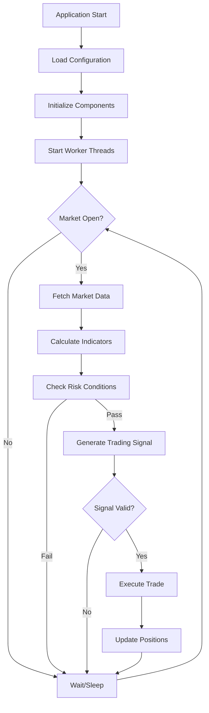

# Alpaca Trader

An algorithmic trading system built in C++ for the Alpaca Markets API. This system implements a multi-threaded, real-time trading bot with risk management, market data processing, and position management capabilities.

## Trading Logic Flow



## System Architecture

The system uses a multi-threaded architecture with the following key components:

- **Main Application** (`main.cpp`) - Orchestrates components and manages worker threads
- **Trading Engine** (`core/trader.cpp`) - Core trading logic, risk management, and order execution
- **Strategy Logic** (`core/strategy_logic.cpp`) - Trading strategy implementation and signal generation
- **Risk Logic** (`core/risk_logic.cpp`) - Risk management calculations and position sizing
- **Market Processing** (`core/market_processing.cpp`) - Market data analysis and processing
- **Technical Indicators** (`core/indicators.cpp`) - Technical analysis indicators and calculations
- **API Client** (`api/alpaca_client.cpp`) - Handles Alpaca API communication and market data
- **Account Manager** (`data/account_manager.cpp`) - Manages account data and position tracking
- **Market Data Thread** (`threads/market_data_thread.cpp`) - Background market data processing
- **Account Data Thread** (`threads/account_data_thread.cpp`) - Background account monitoring
- **Trader Thread** (`threads/trader_thread.cpp`) - Background trading execution thread
- **Logging Thread** (`threads/logging_thread.cpp`) - Background logging thread
- **Thread Manager** (`threads/thread_manager.cpp`) - Thread lifecycle and priority management
- **Logging System** (`logging/async_logger.cpp`) - Thread-safe asynchronous logging
- **Display Layer** (`ui/account_display.cpp`) - Account status presentation

##  Configuration System

The system uses a modular configuration approach with specialized config structures located in the `configs/` directory:

- **`SystemConfig`**: Master configuration aggregator (`configs/system_config.hpp`)
- **`ApiConfig`**: Alpaca API credentials and endpoints (`configs/api_config.hpp`)
- **`StrategyConfig`**: Trading algorithm parameters (ATR periods, multipliers) (`configs/strategy_config.hpp`)
- **`RiskConfig`**: Risk management limits (daily P/L, exposure, position sizing) (`configs/risk_config.hpp`)
- **`TimingConfig`**: Polling intervals and timing parameters (`configs/timing_config.hpp`)
- **`SessionConfig`**: Market hours and timezone settings (`configs/session_config.hpp`)
- **`TargetConfig`**: Target symbol and trading pair configuration (`configs/target_config.hpp`)
- **`FlagsConfig`**: Feature flags and system toggles (`configs/flags_config.hpp`)
- **`UXConfig`**: User experience and display settings (`configs/ux_config.hpp`)
- **`LoggingConfig`**: Logging configuration and output settings (`configs/logging_config.hpp`)


## Risk Management

### Position Sizing
- **Risk per Trade**: Configurable percentage of account equity
- **ATR-based Sizing**: Position size based on market volatility
- **Maximum Exposure**: Portfolio-wide exposure limits

### Daily Limits
- **Profit Target**: Daily profit taking threshold
- **Maximum Loss**: Daily drawdown protection
- **Circuit Breakers**: Automatic trading halt on limit breach

### Market Conditions
- **Trading Hours**: Automated market session validation
- **Volatility Filters**: ATR-based market condition assessment
- **Volume Validation**: Minimum volume requirements for trades

##  Building and Running

### Prerequisites
- **C++17 compatible compiler** (GCC 7+ or Clang 10+)
- **libcurl** for HTTP requests
- **pthread** for threading support

### Build Commands
```bash
# Build project and clean object files (default)
make

# Clean build artifacts
make clean

# Clean only object files (keep binary)
make clean-obj

# Clean everything including binary
make clean-all

# Force rebuild from scratch
make rebuild

# Show help
make help
```

### Running the Application
```bash
# Direct execution
./bin/alpaca_trader

# Background execution
./bin/alpaca_trader &

# View logs in real-time
tail -f trade_log.txt
```


## Project Structure

```
Alpaca Trader/
├── README.md                 # This documentation
├── Makefile                  # Build system configuration
├── main.cpp                  # Application entry point and orchestration
├── main.hpp                  # Main application header
├── trade_log.txt            # Runtime logging output
├── bin/                     # Compiled binaries
│   └── alpaca_trader       # Main executable
├── api/                     # Alpaca API client (modular structure)
│   ├── alpaca_client.cpp    # Main API client facade
│   ├── alpaca_client.hpp    # Main API client interface
│   ├── base/                # Base client functionality
│   │   ├── alpaca_base_client.cpp
│   │   └── alpaca_base_client.hpp
│   ├── clock/               # Market hours and timing
│   │   ├── market_clock.cpp
│   │   └── market_clock.hpp
│   ├── market/              # Market data operations
│   │   ├── market_data_client.cpp
│   │   └── market_data_client.hpp
│   └── orders/              # Order management
│       ├── order_client.cpp
│       └── order_client.hpp
├── core/                    # Core trading system components
│   ├── trader.cpp           # Core trading logic and decision engine
│   ├── trader.hpp           # Core trading engine interface
│   ├── strategy_logic.cpp   # Trading strategy implementation
│   ├── strategy_logic.hpp   # Strategy logic interface
│   ├── risk_logic.cpp       # Risk management calculations
│   ├── risk_logic.hpp       # Risk logic interface
│   ├── market_processing.cpp # Market data analysis and processing
│   ├── market_processing.hpp # Market processing interface
│   ├── indicators.cpp       # Technical analysis indicators
│   └── indicators.hpp       # Technical indicators interface
├── data/                    # Data management
│   ├── account_manager.cpp  # Account data management and operations
│   ├── account_manager.hpp  # Account management interface
│   └── data_structures.hpp  # Common data structures and types
├── threads/                 # Multi-threaded system components
│   ├── account_data_thread.cpp    # Background account data fetching
│   ├── account_data_thread.hpp    # Account data thread interface
│   ├── market_data_thread.cpp     # Background market data processing
│   ├── market_data_thread.hpp     # Market data thread interface
│   ├── trader_thread.cpp          # Background trading execution thread
│   ├── trader_thread.hpp          # Trader thread interface
│   ├── logging_thread.cpp         # Background logging thread
│   ├── logging_thread.hpp         # Logging thread interface
│   ├── thread_manager.cpp         # Thread lifecycle management
│   ├── thread_manager.hpp         # Thread manager interface
│   ├── config/                    # Thread configuration
│   │   ├── thread_config.cpp      # Thread configuration implementation
│   │   └── thread_config.hpp      # Thread configuration interface
│   └── platform/                  # Platform-specific thread control
│       ├── thread_control.cpp     # Cross-platform thread control
│       ├── thread_control.hpp     # Thread control interface
│       ├── linux/                 # Linux-specific implementations
│       │   ├── linux_thread_control.cpp
│       │   └── linux_thread_control.hpp
│       ├── macos/                 # macOS-specific implementations
│       │   ├── macos_thread_control.cpp
│       │   └── macos_thread_control.hpp
│       └── windows/               # Windows-specific implementations
│           ├── windows_thread_control.cpp
│           └── windows_thread_control.hpp
├── logging/                 # Logging system
│   ├── async_logger.cpp     # Thread-safe logging system
│   ├── async_logger.hpp     # Async logging interface
│   ├── logger.cpp           # Basic logging implementation
│   ├── logger.hpp           # Logger interface
│   ├── trading_logger.cpp   # Trading-specific logging
│   ├── trading_logger.hpp   # Trading logger interface
│   ├── thread_logger.cpp    # Thread-specific logging
│   └── thread_logger.hpp    # Thread logger interface
├── ui/                      # User interface
│   ├── account_display.cpp  # Account status presentation layer
│   └── account_display.hpp  # Account display interface
├── utils/                   # Utility functions
│   ├── async_logger.cpp     # Async logging utilities (legacy)
│   ├── config_loader.cpp    # Configuration loading utilities
│   ├── config_loader.hpp    # Config loader interface
│   ├── http_utils.cpp       # HTTP utilities for API communication
│   └── http_utils.hpp       # HTTP utilities interface
├── configs/                 # Configuration structures
│   ├── system_config.hpp    # Master configuration aggregator
│   ├── api_config.hpp       # API configuration
│   ├── strategy_config.hpp  # Strategy configuration
│   ├── risk_config.hpp      # Risk management configuration
│   ├── timing_config.hpp    # Timing configuration
│   ├── session_config.hpp   # Session configuration
│   ├── target_config.hpp    # Target configuration
│   ├── flags_config.hpp     # Feature flags configuration
│   ├── ux_config.hpp        # User experience configuration
│   ├── logging_config.hpp   # Logging configuration
│   └── component_configs.hpp # Component configuration aggregator
├── external/                # External dependencies
│   └── json.hpp            # JSON parsing library (nlohmann/json)
└── config/                  # Runtime configuration
    └── runtime_config.csv  # Runtime configuration file
```


## Thread Prioritization

The system now implements comprehensive thread prioritization for optimal performance:

### Priority Levels
- **TRADER thread**: `HIGHEST` priority - Critical trading decisions
- **MARKET thread**: `HIGH` priority - Real-time market data processing  
- **ACCOUNT thread**: `NORMAL` priority - Account monitoring
- **GATE thread**: `LOW` priority - Market hours validation
- **LOGGER thread**: `LOWEST` priority - Background logging

### Thread Components
- **`TraderThread`** (`threads/trader_thread.cpp`) - Main trading execution thread
- **`MarketDataThread`** (`threads/market_data_thread.cpp`) - Market data processing thread
- **`AccountDataThread`** (`threads/account_data_thread.cpp`) - Account monitoring thread
- **`LoggingThread`** (`threads/logging_thread.cpp`) - Background logging thread
- **`ThreadManager`** (`threads/thread_manager.cpp`) - Thread lifecycle and priority management

---

## TODO:
- Add a generated 32 bit app key that expires regularily
- The delayed data results in invalid bracket orders as share price value chaneges such that the stop loss and take profit are not in the correct position.
- Better handling and logging of trader gate and risk logic.
  - this logic needs to looked at evaluate_trade_gate and can_trade.
- in.core_trading_hours = services.client.is_core_trading_hours();
    - this is failing which has been effecting ability to trade
- go through current order types and look to increase decision performance
  as well add more trade tools to be used by the decision making trader engine
- ensure uniform logging accross the codebase, improve logging implementation, split ligs into 3?
- go through file and folder organisation looking to increase ease
  of use of codebase. make it clear what sections to work on for trying new stratergies
- something to notify that the aplication is running with and to count how
  many instances are running
- clear implementation for the signal analysis
- clear logging for the marget gate thread, fix implementation
- update trade to use a realistic starting capital
- once abstracted sufficiently could the trading stratergy come froma stratergy.csv
  so you wouldnt even need to compile, and the stratergy is not spart of the codebase.
  easier for stratergy testing
- Can the current interface turn into a cmd line controller interface?
  Can manually test some configurations and then save the config.
  What open source cmd line libraries are there or do I make my own.
