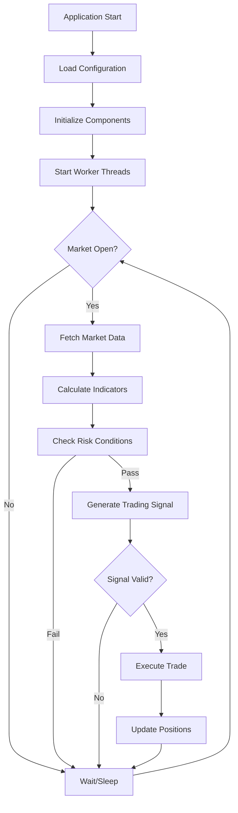

# Alpaca Trader

An algorithmic trading system built in C++ for the Alpaca Markets API. This system implements a multi-threaded, real-time trading bot with risk management, market data processing, and position management capabilities.

## Trading Logic Flow



## System Architecture

The system uses a multi-threaded architecture with the following key components:

- **Main Application** (`main.cpp`) - Orchestrates components and manages worker threads
- **Trading Engine** (`core/trader.cpp`) - Core trading logic, risk management, and order execution
- **API Client** (`api/alpaca_client.cpp`) - Handles Alpaca API communication and market data
- **Account Manager** (`data/account_manager.cpp`) - Manages account data and position tracking
- **Market Data Worker** (`workers/market_data_worker.cpp`) - Background market data processing
- **Account Data Worker** (`workers/account_data_worker.cpp`) - Background account monitoring
- **Logging System** (`utils/async_logger.cpp`) - Thread-safe asynchronous logging
- **Display Layer** (`ui/account_display.cpp`) - Account status presentation

##  Configuration System

The system uses a modular configuration approach with specialized config structures:

- **`ApiConfig`**: Alpaca API credentials and endpoints
- **`StrategyConfig`**: Trading algorithm parameters (ATR periods, multipliers)
- **`RiskConfig`**: Risk management limits (daily P/L, exposure, position sizing)
- **`TimingConfig`**: Polling intervals and timing parameters
- **`SessionConfig`**: Market hours and timezone settings
- **`TargetConfig`**: Target symbol and trading pair configuration


## Risk Management

### Position Sizing
- **Risk per Trade**: Configurable percentage of account equity
- **ATR-based Sizing**: Position size based on market volatility
- **Maximum Exposure**: Portfolio-wide exposure limits

### Daily Limits
- **Profit Target**: Daily profit taking threshold
- **Maximum Loss**: Daily drawdown protection
- **Circuit Breakers**: Automatic trading halt on limit breach

### Market Conditions
- **Trading Hours**: Automated market session validation
- **Volatility Filters**: ATR-based market condition assessment
- **Volume Validation**: Minimum volume requirements for trades

##  Building and Running

### Prerequisites
- **C++17 compatible compiler** (GCC 7+ or Clang 10+)
- **libcurl** for HTTP requests
- **pthread** for threading support

### Build Commands
```bash
# Clean build
make clean

# Compile
make

# Build and run
make run

# Show help
make help
```

### Running the Application
```bash
# Direct execution
./bin/trader

# Background execution
./bin/trader &

# View logs in real-time
tail -f trade_log.txt
```


## Project Structure

```
Alpaca Trader/
├── README.md                 # This documentation
├── Makefile                  # Build system configuration
├── trade_log.txt            # Runtime logging output
├── bin/                     # Compiled binaries
│   └── trader              # Main executable
├── src/                     # Source code implementation
│   ├── main.cpp            # Application entry point and orchestration
│   ├── api/
│   │   └── alpaca_client.cpp    # Alpaca API client implementation
│   ├── core/
│   │   └── trader.cpp           # Core trading logic and decision engine
│   ├── data/
│   │   └── account_manager.cpp  # Account data management and operations
│   ├── ui/
│   │   └── account_display.cpp  # Account status presentation layer
│   ├── utils/
│   │   ├── async_logger.cpp     # Thread-safe logging system
│   │   ├── http_utils.cpp       # HTTP utilities for API communication
│   │   └── indicators.cpp       # Technical analysis indicators
│   └── workers/
│       ├── account_data_worker.cpp  # Background account data fetching
│       └── market_data_worker.cpp   # Background market data processing
└── include/                 # Header files and interfaces
    ├── Config.hpp           # Master configuration aggregator
    ├── configs/             # Configuration structures
    ├── api/
    │   └── alpaca_client.hpp    # Alpaca API client interface
    ├── core/
    │   └── trader.hpp           # Core trading engine interface
    ├── data/
    │   ├── account_manager.hpp  # Account management interface
    │   └── data_structures.hpp  # Common data structures and types
    ├── external/
    │   └── json.hpp            # JSON parsing library (nlohmann/json)
    ├── ui/
    │   └── account_display.hpp  # Account display interface
    ├── utils/
    │   ├── async_logger.hpp     # Async logging interface
    │   ├── http_utils.hpp       # HTTP utilities interface
    │   └── indicators.hpp       # Technical indicators interface
    └── workers/
        ├── account_data_worker.hpp  # Account data worker interface
        └── market_data_worker.hpp   # Market data worker interface
```


TODO:
- Add a generated 32 bit app key that expires regularily
- The delayed data results in invalid bracket orders as share price value chaneges such that the stop loss and take profit are not in the correct position.
- Better handling and logging of trader gate and risk logic.
  - this logic needs to looked at evaluate_trade_gate and can_trade.
- Need to add thread priority to the threads. 
- in.core_trading_hours = services.client.is_core_trading_hours();
    - this is failing which has been effecting ability to trade
- go through current order types and look to increase decision performance
  as well add more trade tools to be used by the decision making trader engine
- ensure uniform logging accross the codebase, improve logging implementation, split ligs into 3?
- go through file and folder organisation looking to increase ease
  of use of codebase. make it clear what sections to work on for trying new stratergies
- something to notify that the aplication is running with and to count how
  many instances are running
- logging currently has an issue, it could be because of the current blocking implementation
- clear implementation for the signal analysis
- clear logging for the marget gate thread, fix implementation
- update trade to use a realistic stsrting capital
- once abstracted sufficiently could the tradine stratergy come froma stratergy.csv
  so you wouldnt even need to compile, and the stratergy is not spart of the codebase.
  easier for stratergy testing
- Can the current interface turn into a cmd line controller interface?
  will logging need to change? with background threads you could either show whats being logged 
  or a menu interface. Can manually test some configurations and then save the config.
  What open source cmd line libraries are there or do I make my own.
- update make to add git commit and branch name to built .exe
