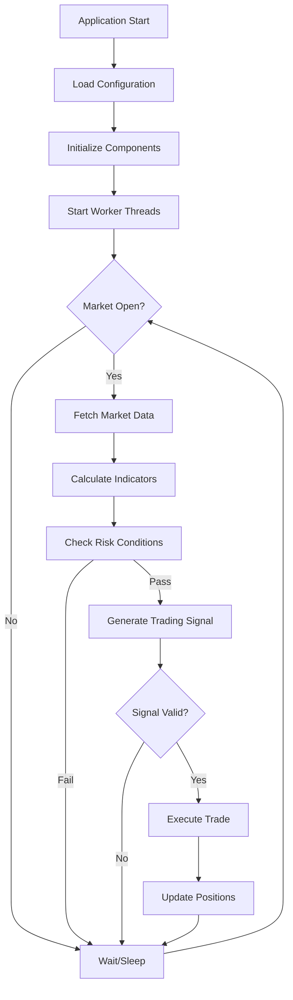

# Alpaca Trader

An algorithmic trading system built in C++ for the Alpaca Markets API. This system implements a multi-threaded, real-time trading bot with risk management, market data processing, and position management capabilities.

## Trading Logic Flow



## System Architecture

The system uses a multi-threaded architecture with the following key components:

##  Configuration System

The system uses a modular configuration approach with specialized config structures located in the `configs/` directory:


### Build Commands
```bash
# Build project and clean object files (default)
make

# Clean build artifacts
make clean

# Clean only object files (keep binary)
make clean-obj

# Clean everything including binary
make clean-all

# Force rebuild from scratch
make rebuild

# Show help
make help
```

### Running the Application
```bash
# Direct execution
./bin/alpaca_trader

# Background execution
./bin/alpaca_trader &

# View logs in real-time
tail -f trade_log.txt
```
---

## TODO:

- Add a generated 32-bit app key that expires regularly
- Optimize order types and add more trading tools for decision engine

- Add application status notification and instance counting
- Implement clear signal analysis framework

- Evaluate command-line controller interface for configuration testing
