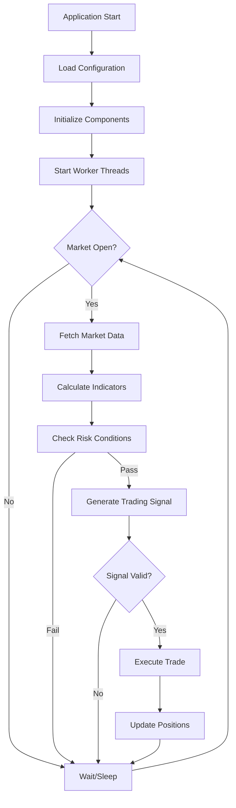

# Alpaca Trader

An algorithmic trading system built in C++ for the Alpaca Markets API. This system implements a multi-threaded, real-time trading bot with risk management, market data processing, and position management capabilities.

## Trading Logic Flow



## System Architecture

The system uses a multi-threaded architecture with the following key components:

##  Configuration System

The system uses a modular configuration approach with specialized config structures located in the `configs/` directory:


### Build Commands
```bash
# Build project and clean object files (default)
make

# Clean build artifacts
make clean

# Clean only object files (keep binary)
make clean-obj

# Clean everything including binary
make clean-all

# Force rebuild from scratch
make rebuild

# Show help
make help
```

### Running the Application
```bash
# Direct execution
./bin/alpaca_trader

# Background execution
./bin/alpaca_trader &

# View logs in real-time
tail -f trade_log.txt
```
---

## TODO:
- Add a generated 32 bit app key that expires regularily
- The delayed data results in invalid bracket orders as share price value chaneges such that the stop loss and take profit are not in the correct position.
- Better handling and logging of trader gate and risk logic.
  - this logic needs to looked at evaluate_trade_gate and can_trade.
- in.core_trading_hours = services.client.is_core_trading_hours();
    - this is failing which has been effecting ability to trade
- go through current order types and look to increase decision performance
  as well add more trade tools to be used by the decision making trader engine
- ensure uniform logging accross the codebase, improve logging implementation, split ligs into 3?
- go through file and folder organisation looking to increase ease
  of use of codebase. make it clear what sections to work on for trying new stratergies
- something to notify that the aplication is running with and to count how
  many instances are running
- clear implementation for the signal analysis
- clear logging for the marget gate thread, fix implementation
- update trade to use a realistic starting capital
- once abstracted sufficiently could the trading stratergy come froma stratergy.csv
  so you wouldnt even need to compile, and the stratergy is not spart of the codebase.
  easier for stratergy testing
- Can the current interface turn into a cmd line controller interface?
  Can manually test some configurations and then save the config.
  What open source cmd line libraries are there or do I make my own.
