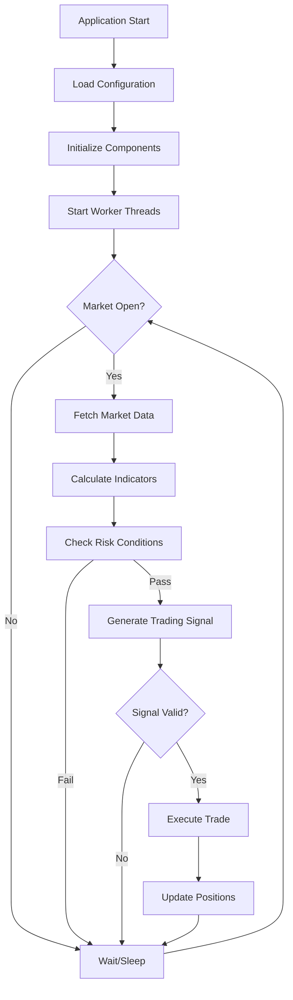

# Alpaca Trader

An algorithmic trading system built in C++ for the Alpaca Markets API. This system implements a multi-threaded, real-time trading bot with risk management, market data processing, and position management capabilities.

## Trading Logic Flow



## System Architecture

The system uses a multi-threaded architecture with the following key components:

##  Configuration System

The system uses a modular configuration approach with specialized config structures located in the `configs/` directory:


### Build Commands
```bash
# Build project and clean object files (default)
make

# Clean build artifacts
make clean

# Clean only object files (keep binary)
make clean-obj

# Clean everything including binary
make clean-all

# Force rebuild from scratch
make rebuild

# Show help
make help
```

### Running the Application
```bash
# Direct execution
./bin/alpaca_trader

# Background execution
./bin/alpaca_trader &

# View logs in real-time
tail -f trade_log.txt
```
---

## TODO:

- Go through all functions and files and limit the scope of each function and file to the minimum necessary to achieve the desired functionality.
- Replace hardcoded dependencies with proper DI container to improve testability and modularity
- Add circuit breaker for API calls to prevent cascade failures during outages
- Replace raw std::thread usage with modern C++20 coroutines for better resource management
- Implement analysis across multiple timeframes (1m, 5m, 15m, 1h) for better signal confirmation
- Add RSI, MACD, Bollinger Bands, Stochastic Oscillator, and Fibonacci retracements
- Implement ML models for pattern recognition and signal prediction
- Replace fixed sizing with Kelly Criterion and dynamic risk adjustment
- Add volatility regime detection to adjust strategy parameters dynamically
- Implement VaR (Value at Risk), Expected Shortfall
- Implement dynamic stop-losses and position reduction during drawdowns
- Add order book analysis and slippage modeling
- Add indexing and query optimization for large datasets
- Implement Modern Portfolio Theory and risk parity strategies

